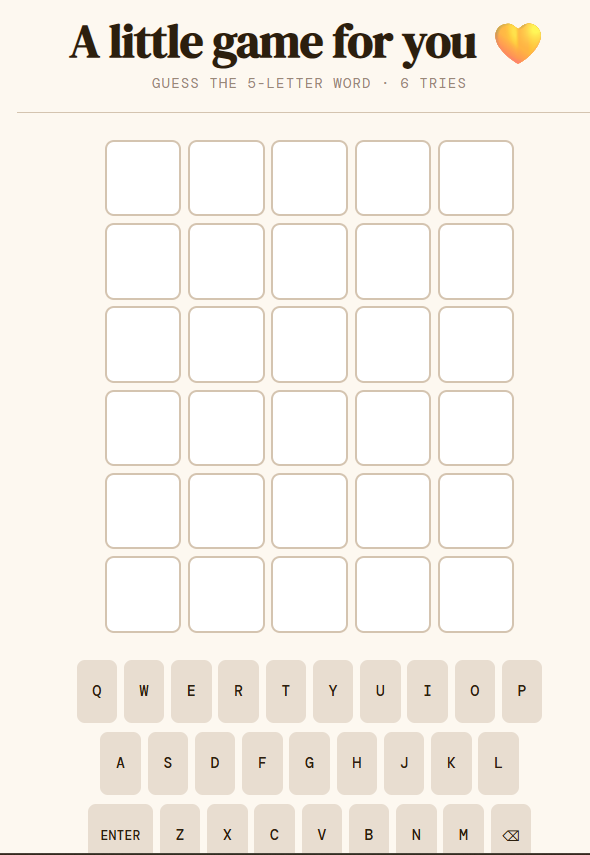

# Simple Wordle Clone

A clean, browser-based clone of [Wordle](https://www.nytimes.com/games/wordle/index.html) built with vanilla HTML, CSS, and JavaScript — no frameworks, no build step. Served via Docker + Nginx.

**Live demo:** [wordle.dsobani.com](https://wordle.dsobani.com/)



## How to Play

1. Guess the 5-letter word in 6 tries
2. Type letters and press **Enter** to submit (or use the on-screen keyboard)
3. Tile colors reveal how close your guess was:
   - **Green** — right letter, right position
   - **Yellow** — right letter, wrong position
   - **Gray** — letter not in the word
4. The on-screen keyboard tracks which letters you've already used

## Running the Game

Requires [Docker](https://www.docker.com/) and Docker Compose.

```bash
docker-compose up
```

Then open [http://localhost:6001](http://localhost:6001) in your browser.

## Customizing the Answer Word

Edit the `SECRET` constant near the top of [wordle.html](wordle.html) to any 5-letter word you like.

## How It Works

The entire game lives in a single file — [wordle.html](wordle.html) — with inline CSS and JavaScript.

**Scoring logic** uses a two-pass algorithm (the same approach the original Wordle uses):
1. First pass marks exact matches (green)
2. Second pass marks letters present elsewhere, using a "used" tracker to handle duplicate letters correctly

**Guess validation** checks against a built-in set of ~1500 valid 5-letter words before accepting a submission.

**Win/loss overlays** appear after the game ends, showing the answer and a "Play Again" button. Win messages vary based on how many guesses it took (1 guess → "Brilliant! 🌟", 6 guesses → "Phew! Got there! 😅").

The UI uses CSS Grid for the tile board, CSS custom properties for theming, and 3D `transform` animations for tile flips.
